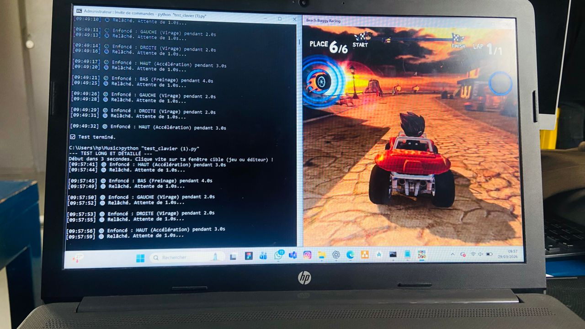
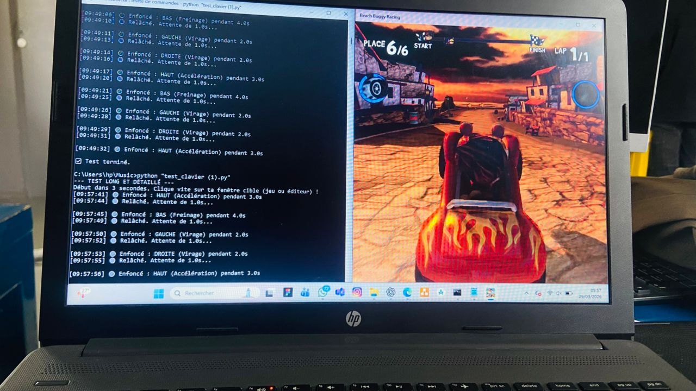
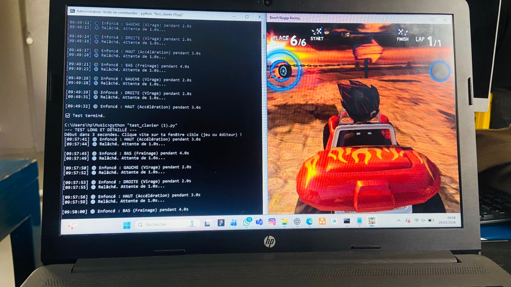
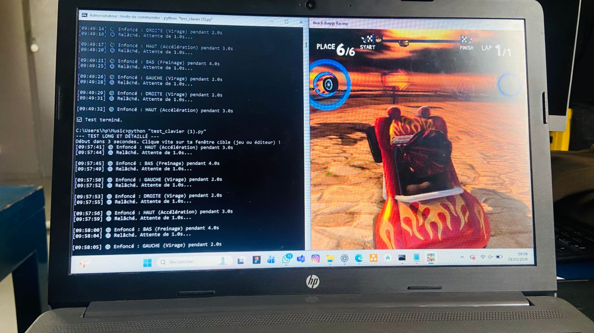
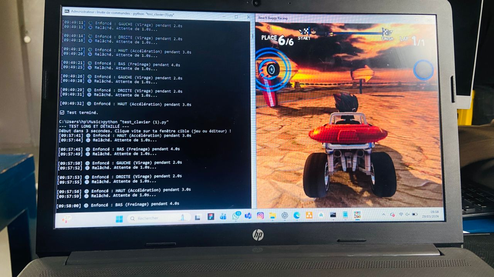

# Project Gallery

The photos below show the **Gesture Game Controller** in action during **Arduino Days 2026 at Semè City**.

On the left side of each screenshot you can see the Python script running in the terminal, displaying every key press in real time. On the right side, the game **Beach Buggy Racing** reacts instantly to each hand gesture.

---

## Demo — Python script + Beach Buggy Racing

### The Python script sending commands to the game

*The terminal shows every gesture detected: UP (Acceleration), DOWN (Braking), LEFT (Turn left), RIGHT (Turn right). The game reacts in real time.*

---

*Each line in the terminal corresponds to a key press sent to the game. The timestamps confirm the real-time responsiveness of the system.*

---

*When a LEFT or RIGHT gesture is detected, the buggy steers accordingly — no keyboard involved.*

---

*The script runs a full test sequence: acceleration, braking, left turn, right turn — all triggered by hand movements.*

---

*The complete pipeline working end-to-end: gesture detected → Python receives it → Beach Buggy Racing responds.*

---

## What the terminal output means

| Terminal message | Meaning |
|-----------------|---------|
| `Enfoncé : HAUT (Accélération) pendant 3.0s` | UP gesture → Arrow Up pressed 3s |
| `Enfoncé : BAS (Freinage) pendant 4.0s` | DOWN gesture → Arrow Down pressed 4s |
| `Enfoncé : GAUCHE (Virage) pendant 2.0s` | LEFT gesture → Arrow Left pressed 2s |
| `Enfoncé : DROITE (Virage) pendant 2.0s` | RIGHT gesture → Arrow Right pressed 2s |
| `Relâché. Attente de 1.0s...` | Key released, waiting 1s before next gesture |
